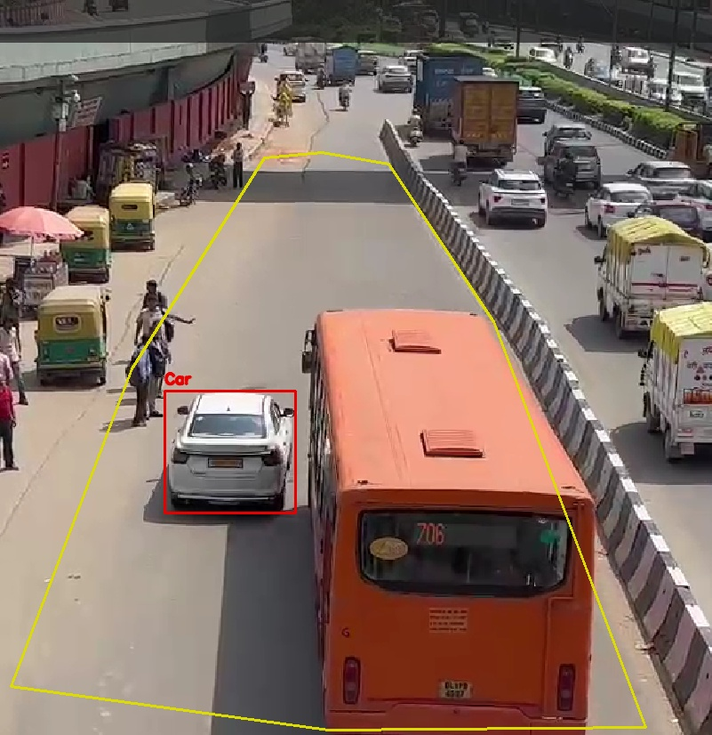

# TrafficAI 🚦

TrafficAI is an AI-powered traffic management system consisting of three computer vision models:

- 🚥 Traffic Signal Optimization
- 🚌 Bus Lane Violation Detection
- 🅿️ Parking Occupancy Detection

Built using **FastAPI**, **YOLO11**, **OpenCV**, and **Python**.

---

# Project Structure

```bash
TrafficAI/
│
├── Documents/
├── models/
├── predictors/
├── scripts/
├── testing/
├── tools/
│
├── app.py
├── requirements.txt
├── slots.json
├── lanecoordinates.json
├── README.md
└── .gitignore
```

---

# Models Overview


| Model | Endpoint |
|-------|----------|
| Signal Prediction | `/predict/signal` |
| Bus Lane Detection | `/predict/buslane` |
| Parking Occupancy | `/predict/parking` |


---

# Setup Guide


## 1. Clone Repository

```bash
git clone <repo-url>

cd TrafficAI
```


## 2. Create Virtual Environment


Windows

```bash
python -m venv venv

venv\Scripts\activate
```


Linux/Mac


```bash
python3 -m venv venv

source venv/bin/activate
```


## 3. Install Dependencies


```bash
pip install -r requirements.txt
```


## 4. Run FastAPI Server


```bash
uvicorn app:app --reload --port 8000
```


Server runs at


```bash
http://localhost:8000
```


Swagger Docs


```bash
http://localhost:8000/docs
```


Health Check


```bash
GET /health
```


Response


```json
{
    "status":"ok"
}
```


---

# Model 1 : Traffic Signal Optimization


### Endpoint


```bash
POST /predict/signal
```


### Postman Setup


Method

```text
POST
```


URL


```bash
http://localhost:8000/predict/signal
```


Body


Select


```text
form-data
```


| Key | Type | Example |
|------|------|---------|
| traffic_image | File | road.jpg |
| road_width | Text | 7.5 |
| signal_id | Text | SIG_001 |
| timestamp | Text | 2025-06-21T10:00:00 |
| previous_vehicle_count | Text | 12 |
| previous_red_light_time | Text | 18 |


### Sample Response


```json
{
"vehicle_count":8,
"traffic_density":"medium",

"recommended_green_time":20,

"recommended_yellow_time":3,

"recommended_red_time":18,

"confidence_score":0.85,

"signal_id":"SIG_001",

"annotated_image":"<base64>"
}
```


---

### Sample Output


```markdown

```


---


# Model 2 : Bus Lane Violation Detection 🚌


### Endpoint

```bash
POST /predict/buslane
```


## Bus Lane Coordinate Picker

Before testing the API, bus lane coordinates must be generated from the **same image**
that will be uploaded to the endpoint.

TrafficAI provides an interactive coordinate picker.

Tool Location

```bash
tools/pick_lane.py
```


### Run Coordinate Picker


```bash
python tools/pick_lane.py testing/BusLane/Testing4.png
```


or


```bash
python tools/pick_lane.py testing/BusLane/Testing4.png --output lanecoordinates.json
```


### Controls


| Key | Action |
|------|--------|
| Left Click | Add Point |
| U | Undo Last Point |
| R | Reset Points |
| S | Save Coordinates |
| Q | Quit Without Saving |


### How It Works


Open the image.


Click points around the bus lane boundary.


Recommended:


* 4 points on the near edge
* 4 points on the far edge


Total = **8 Points**


Press


```text
S
```


to save.


Coordinates are stored in


```bash
lanecoordinates.json
```


Example


```json
{
"Testing4.png":
[
[297,177],
[148,414],
[12,771],
[369,820],
[726,817],
[555,361],
[437,184],
[362,171]
]
}
```


Copy these coordinates into Postman under


```text
bus_lane_coordinates
```


---

## Postman Testing


Method


```text
POST
```


URL


```bash
http://localhost:8000/predict/buslane
```


Body → form-data


| Key | Type | Value |
|------|------|-------|
| lane_image | File | Testing4.png |
| signal_id | Text | 12 |
| bus_lane_coordinates | Text | JSON Coordinates |


Expected Response


```json
{
"unauthorized_count":4,

"confidence_score":0.96,

"violations":[
{
"type":"Car",
"bbox":[240,110,340,270]
}
],

"annotated_image":"<base64>"
}
```


### Visualize Annotated Image


Tests Tab


```javascript
const data = pm.response.json();

pm.visualizer.set(

``,

{ img: data.annotated_image }

);
```


### Output Image


```md

```


---
# Model 3 : Parking Occupancy Detection 🅿️


### Endpoint


```bash
POST /predict/parking
```


## Parking Slot Coordinate Picker


Parking slots must be selected before testing the API.


TrafficAI provides


```bash
tools/pick_slots.py
```


---

### Run Coordinate Picker


```bash
python tools/pick_slots.py testing/Parking/image1.jpg
```


### Controls


| Key | Action |
|------|--------|
| Left Click | Add Corner |
| N | Finish Slot |
| U | Undo |
| S | Save All Slots |
| Q | Quit Without Saving |


---


### How It Works


Open parking image.


Click around the parking slot boundary.


Usually


* 4 points per slot
* Follow slot corners in order


After selecting a slot


Press


```text
N
```


to start selecting the next slot.


Repeat until all slots are marked.


Press


```text
S
```


to save.


---

Generated file


```bash
slots.json
```


Example


```json
[
{
"id":1,
"coordinates":[82,782,46,898,146,903,184,784]
},

{
"id":2,
"coordinates":[188,784,156,900,267,896,284,782]
}
]
```


Copy the JSON output into Postman.


Field name


```text
parking_slots
```


---

## Postman Testing


Method


```text
POST
```


URL


```bash
http://localhost:8000/predict/parking
```


Body → form-data


| Key | Type | Value |
|------|------|-------|
| parking_image | File | image1.jpg |
| parking_id | Text | lot-1 |
| parking_slots | Text | JSON Output |


Expected Response


```json
{
"total_slots":12,

"occupied_slots":5,

"vacant_slots":7,

"occupancy_rate":42,

"confidence_score":0.87,

"slot_status":[
{
"id":1,
"status":"Occupied"
}
],

"annotated_image":"<base64>"
}
```


### Visualize Annotated Image


Tests Tab


```javascript
const data = pm.response.json();

pm.visualizer.set(

``,

{ img: data.annotated_image }

);
```


### Output Image


```md


```


---


# Technologies Used


- FastAPI
- Uvicorn
- Ultralytics YOLO11
- OpenCV
- NumPy
- Pydantic
- Python Multipart
- Postman


---

# Future Improvements


- Fine-tune YOLO on Indian traffic datasets
- Docker support
- API authentication
- Database logging
- Unified traffic dashboard


---

## Author

**Adarsh Kumar**

B.Tech IT • GGSIPU

TrafficAI Project
